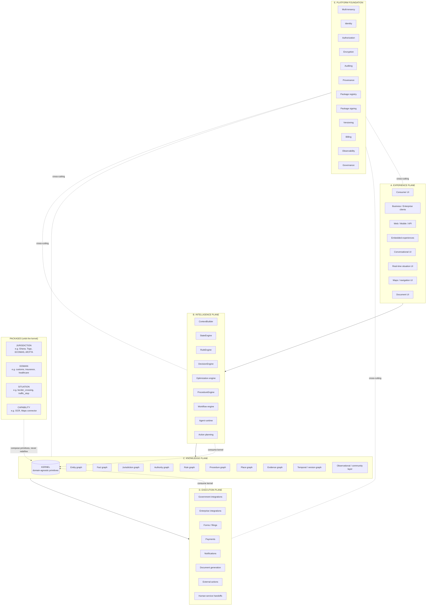
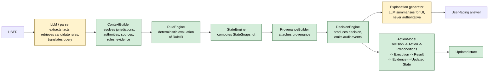

# Architecture Diagrams — Planes and Request Flow

> Source: section 2 (planes), section 10 (preferred flow) of the source specification.
> Status: FROZEN. Changes require an ACO.

---

## 1. The 5 Planes and the kernel-at-center / packages-orbiting model

The kernel lives at the center of the Knowledge plane and is consumed by the Intelligence and Execution planes. Packages orbit the kernel; vertical, country, situation, and capability packages compose primitives but never redefine them (per I1, I3, I4, I11).



### ASCII variant (renders without a Mermaid viewer)

```
+------------------------------------------------------------------+
| A. EXPERIENCE PLANE                                              |
|   consumer | business | enterprise | web | mobile | API | embed   |
|   conversational | real-time situation | maps/nav | document     |
+--------------------------------+---------------------------------+
                                 |
+--------------------------------v---------------------------------+
| B. INTELLIGENCE PLANE                                            |
|   ContextBuilder | StateEngine | RuleEngine | DecisionEngine     |
|   Optimization | ProcedureEngine | Workflow | Agent | Actions   |
+--------------------------------+---------------------------------+
                                 |
+--------------------------------v---------------------------------+
| C. KNOWLEDGE PLANE                                              |
|                                                                  |
|   +----------------------------------------------------------+   |
|   |                    KERNEL (domain-agnostic)              |   |
|   |   Entity Fact Jurisdiction Authority Rule RuleIR         |   |
|   |   Situation Procedure Action Document Evidence           |   |
|   |   Right Obligation Permission Restriction Fee Actor ...  |   |
|   +--------------------------^-----------------------------+   |
|                              |                                   |
|   graphs: entity | fact | jurisdiction | authority | rule |     |
|   procedure | place | evidence | temporal/version | obs         |
|                                                                  |
+--------------------------------+---------------------------------+
                                 |
+--------------------------------v---------------------------------+
| D. EXECUTION PLANE                                               |
|   government | enterprise | forms | filings | payments |          |
|   notifications | document generation | external | handoffs      |
+------------------------------------------------------------------+

+------------------------------------------------------------------+
| E. PLATFORM FOUNDATION (cross-cutting, all planes)               |
|   multi-tenancy | identity | authorization | encryption |        |
|   auditing | provenance | package registry | package signing |  |
|   versioning | billing | observability | governance              |
+------------------------------------------------------------------+

           PACKAGES orbit the KERNEL (compose, never redefine):
   +-----------+ +-----------+ +--------------+ +-------------+
   |JURISDICTION| |  DOMAIN   | |  SITUATION   | | CAPABILITY  |
   | Ghana      | | customs   | | border_      | | OCR pack    |
   | Togo       | | insurance | | crossing     | | Maps conn   |
   | ECOWAS     | | healthcare| | traffic_stop | | Gov filing  |
   | AfCFTA     | | property  | | hospital_adm | | connector   |
   +-----------+ +-----------+ +--------------+ +-------------+
              |           |             |              |
              +-----------+------------+--------------+
                          | compose primitives
                          v
                    +-----------+
                    |  KERNEL   |
                    +-----------+
```

---

## 2. Request flow

The preferred flow (section 10) is:

```
USER → LLM / parser → structured context → rule engine → decision/state → explanation generator → action → updated state
```

The LLM is **never** authoritative (per I5). Authoritative evaluation happens in the deterministic `RuleEngine` and is captured in `StateSnapshot` with `Provenance`.



### ASCII variant

```
                            NON-AUTHORITATIVE              AUTHORITATIVE
                            (LLM-assisted)                 (deterministic)
                            ------------------             ------------------

  USER -----------> LLM / parser
                   - extract facts  (T3)
                   - retrieve candidate rules
                   - translate query
                          |
                          v
                   ContextBuilder  ----------------------+
                   - resolve jurisdictions               |
                   - resolve authorities                 |
                   - resolve sources                     |
                   - filter applicable rules (asOf)     |
                          |                             |
                          v                             |
                   RuleEngine  <-------------------------+
                   - deterministic RuleIR evaluation
                   - produces calculation trace
                          |
                          v
                   StateEngine
                   - computes StateSnapshot
                   - fires effects (rights/obligations/...)
                          |
                          v
                   ProvenanceBuilder
                   - ruleId + ruleVersion
                   - source + authority
                   - facts + evidence
                   - calculation + assumptions
                   - truthLevel + asOf
                          |
                          v
                   DecisionEngine
                   - emits DECISION_PRODUCED audit event
                          |
                          +--------------------> Explanation generator
                          |                     - LLM summarises for UI
                          |                     - NEVER authoritative (I5)
                          v                             |
                   ActionModel                          v
                   - Preconditions check           User-facing answer
                   - Execute (FILE/PAY/NOTIFY/
                     NAVIGATE/SUBMIT/GENERATE_...
                     DOCUMENT/REQUEST_INFO/
                     REPORT/HANDOFF)
                   - Result + Evidence
                          |
                          v
                   Updated state
```

### Key non-flow (forbidden)

```
USER --> LLM --> unsupported legal conclusion     # FORBIDDEN per I5
```

---

## Invariants enforced by the diagrams

- **I1** — kernel sits at the center, no vertical concepts leak in.
- **I3, I4** — packages orbit the kernel; they compose primitives, never redefine them.
- **I5** — the request flow places LLMs only at the parser and explanation stages, never in the authoritative evaluation path.
- **I6** — provenance is built for every decision before the action layer runs.
- **I7** — `asOf` is honoured by `ContextBuilder` and `RuleEngine`.
- **I13** — the deterministic path (ContextBuilder → RuleEngine → StateEngine → ProvenanceBuilder → DecisionEngine) is reproducible across runs.

## See also

- `contracts/context.md`, `contracts/rule.md`, `contracts/state.md`, `contracts/decision.md`, `contracts/action.md`, `contracts/audit.md` — the contract surfaces behind each box.
- `fixtures/border-crossing-golden-01.json` — a concrete instance of the request flow for a border crossing.
